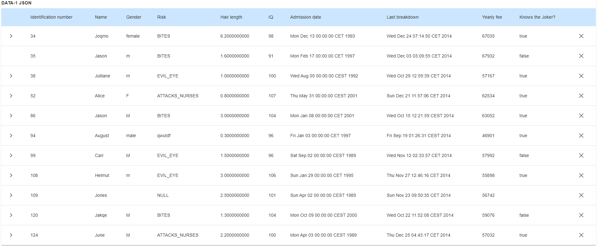
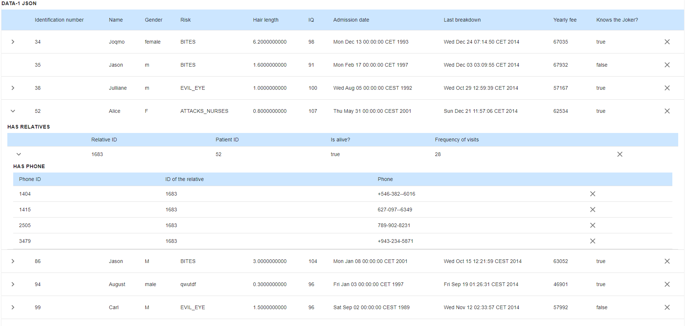

# hierarchy_table

## Architecture

The application was created by create-react-app (The unused boilerplate code and png etc.. are left intact even though they are not used) with typescript template.
Eslint and prettier are configured, although some linting rules are turned off.
The Table displays nested data with collapsible rows and the components are named after the data they contain as follows:

- MainTable and MainRow
- RelativeTable and RelativeRow
- PhoneTable

Rows can be deleted on each level and parent's collapse option is removed if all children get deleted from the corresponding sub table.
Rows and setRows are provided to the children components by using context through a custom hook to avoid passing props at row deletion.

Some basic test cases (not full coverage) are implemented with react-testing-library

- General app render
- Deleting first main row
- Opening first main row
- Context tests

### Run the app

cd into table-app:
- npm i
- npm start

### Test the app

cd into table-app:

- npm test (OR npm test -- --coverage)

### Screenshots

  

  

